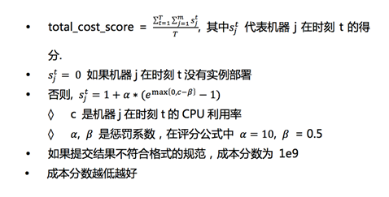

### 1.2数据描述

问题一共包含四份数据表：instance\_deplo y.csv, app\_reso urces.csv, machine\_reso urces.csv, app\_interference.csv

·instance\_deplo y.csv

o 实例id

o 实例所属应用

o 实例所属宿主机:

§注：当前未分配的实例，实例所属宿主机列为空

·app\_reso urces.csv

o 应用id

o cpu分时占用曲线（每个点由&lt; \| &gt;隔开）

o mem分时占用曲线（每个点由&lt; \| &gt;隔开）

o disk申请量（标量）

o P

o M

o PM

·machine\_reso urces.csv

o 宿主机id

o cpu规格

o mem规格

o disk规格

o P上限

o M上限

o PM上限

·app\_interference.csv

o 应用id1

o 应用id2

o 最大部署量

### 1.3结果提交

#### 1.3.1格式（初赛）

提交的结果是一系列对应用实例进行分配或迁移的决策动作，顺序由第一行开始，到最后一行，格式为：

&lt;实例ID&gt;, &lt;目标宿主机ID&gt;

&lt;实例ID&gt;, &lt;目标宿主机ID&gt;

&lt;实例ID&gt;, &lt;目标宿主机ID&gt;

&lt;实例ID&gt;, &lt;目标宿主机ID&gt;

... ...

·**要求**

o 最终所有实例都要部署到宿主机中

o 不能出现无效的实例id或宿主机id

o 请保存为submit\_&lt;YYMMDD\_hhmmss&gt;.csv。&lt;YYMMDD\_hhmmss&gt;是结果生成时的时间戳，这是我们建议的结果命名方式

1.3.2执行与评分（初赛）

·**可执行性**

o 决策动作会按文件从上到下的顺序串行执行，若遇到不可执行的操作，评价程序会中断，并直接开始评价当前状态的得分

### ·**评分**

o 根据执行完提交结果的最终状态，计算成本分数_to tal\_co st\_sco re_




#### 1.3.3对方案的评测

·初赛成绩以提交结果的评分为准

·复赛阶段会要求排名前10的队伍提交代码与文档，进行方案评测。同时参考提交结果的评分及方案，进入决赛，角逐冠军

·方案评测的细节，会于复赛前公布，基本会遵循以下原则：

o 求解时间短\(例如1小时以内，具体要求复赛确定\)

o 鼓励策略性模型\(可以快速输出部分决策，但效果是前提\)

o 鼓励创新性

o 鼓励灵活性

#### 1.3.4推荐的复赛提交格式（暂定）

在第二阶段比赛（复赛）接近尾声时，我们会要求排行榜排名前10的队伍提交针对复赛题目的计算出迁移方案的代码，进行线下评测。迁移方案和线下评测的标准会在“评价标准”中说明，如果参赛队伍不能提供代码、或者提交代码与结果不匹配，相应的排行榜成绩无效。

下面是对提交代码的要求，建议参赛选手按照这个要求组织自己的代码，方便在取得好成绩以后进行提交（代码结构见注1）。

·数据文件夹data/\*.csv

o 选手无需提交数据文件，我们会把初赛复赛用到的所有原始文件（与官网上的文件和文件名一致）放到data文件夹下，选手生成的中间文件也放入该文件夹。注意的是，初始的时候data文件夹会被清空，并只放入原始文件

·代码文件夹co de/\*.py（也可以用其他语言编写）

o 读入文件的路径尽量使用相对路径，比如../data/XX.csv

o 要有main.py或者main.ipynb去运行所有代码得到最后结果（或其它编程语言的main），并将结果保存到submit文件夹

·结果输出文件夹submit/\*.csv

o 存储提交的csv文件

o 提交文件名称submit\_Ymd\_HMS.csv\(e.g.submit\_20180203\_040506.csv\)

·代码的随机

o 对于用到随机数的步骤，设定随机数。如果未设置随机数导致结果有随机性，将进行多轮运行取平均的方式，如果随机的误差大于提交结果与答案间的误差将被取消决赛资格。由于代码会运行多次，为避免覆盖结果文件，请选手将每次生成的结果文件以时间方式命名，如注2所示

注1:提交文件夹结构

·pro ject

·\|--README.md

·\|--data

·\|--co de

·\|-- main.py o r main.ipynb o r &lt;其它语言代码&gt;

·\|--submit

·\|-- submit\_20180203\_040506.csv

注2:提交文件文件名代码
```angular2html
# pytho n fo r example
impo rt datetime
data.to \_csv\(\("../submit/submit\_"+datetime.datetime.no w\(\).strftime\('%Y%m%d\_%H%M%S'\) + ".csv"\), header=No ne, index=False\)

```
### 1.4你可以用这份数据设计其它算法

下面的要求不是比赛的一部分，但同样是数据中心资源调度关心的目标。爱好者可以根据这份数据设计以下面需求之一为目的的调度算法。我们十分欢迎您与我们交流您的想法！

1.同样是上述数据和问题，设计在线调度算法。所谓在线调度算法，是待调度的任务顺序地被调度器调度，而调度器不知道待调度任务序列中靠后的任务的信息。实践中，在线算法只能接近，但很难达到离线算法的效果。

2.让算法更ro bustness。实际环境中，大量数据为建模预估产生的模型化数据，例如赛题中的cpu, mem分时占用曲线，如何在预估数据存在偏差的前提进行问题求解，或者如何在已知决策模型的前提下调整预估方法，也是充满挑战的问题。

3.其它任何你能想到的使用这份数据可以设计的问题和算法。如果你对这个有兴趣，我们相信你会对我们第二阶段的比赛更加有兴趣，请保持关注并一定参加我们的正式比赛！